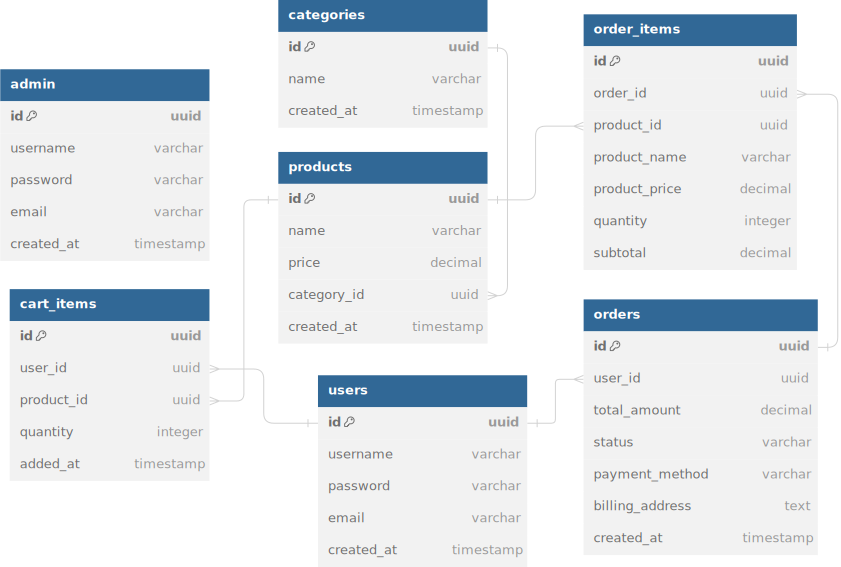

# Ecommerce

## Overview

This project is an MVP (Minimum Viable Product) for an ecommerce platform that provides essential features for online shopping. The platform is built using Go and several modern technologies to ensure performance, security, and scalability.

## Features

1. **View Products by Category**
   - Customers can browse products organized by different categories.
   
2. **Add to Shopping Cart**
   - Customers can select products and add them to their shopping cart.
   
3. **View Shopping Cart**
   - Customers can see a list of products they have added to their shopping cart.
   
4. **Modify Shopping Cart**
   - Customers can remove products from their shopping cart.
   
5. **Checkout and Payments**
   - Customers can proceed to checkout and complete payment transactions securely.
   
6. **User Authentication**
   - Customers can register and log in to their accounts.


## Entity Relationship Diagram



## Tech Stack

- **Golang**: The main programming language for the backend.
- **JWT**: JSON Web Tokens for secure user authentication.
- **Redis**: In-memory data structure store for managing sessions and caching.
- **Postgres**: Relational database for storing application data.
- **GORM**: ORM library for Golang, providing schema management and database querying capabilities.
- **Go Fiber**: An Express-inspired web framework for building fast APIs with Golang.
- **Docker**: For containerization and deployment of the application.

## Getting Started

### Prerequisites

- [Go](https://golang.org/doc/install)
- [Docker](https://docs.docker.com/get-docker/)
- [Postgres](https://www.postgresql.org/download/)
- [Redis](https://redis.io/download)

### Installation

1. **Clone the repository**

    ```sh
    git clone https://github.com/hebobibun/go-ecommerce.git
    cd go-ecommerce
    ```

2. **Set up environment variables**

    Create a `.env` file in the root of the project with the following content:

    ```env
    PORT=9090
    DNS= "host=localhost user=db_user password=db_password dbname=db_name port=5432 sslmode=disable"
    JWT_SECRET=your_jwt_secret
    ```

3. **Run the application with Docker**

    ```sh
    docker-compose up
    ```

    Docker will set up all necessary services including Postgres and Redis, and launch the application.

## Contributing

Contributions are welcome! Please open an issue or submit a pull request with your improvements.

## License

This project is licensed under the MIT License. See the [LICENSE](LICENSE) file for details.
